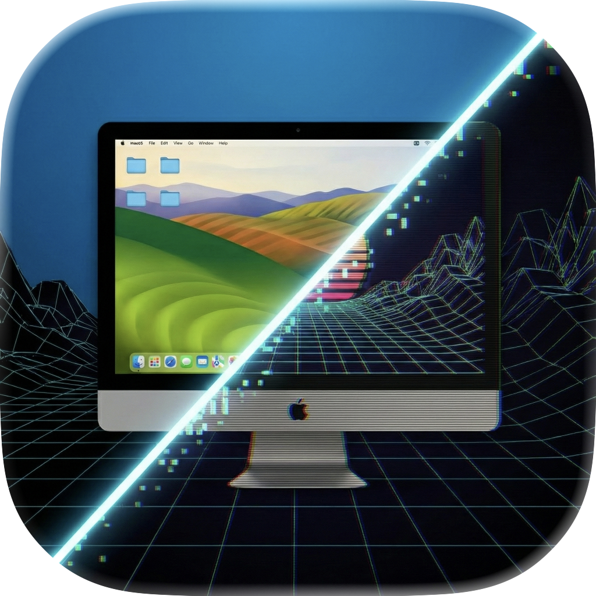
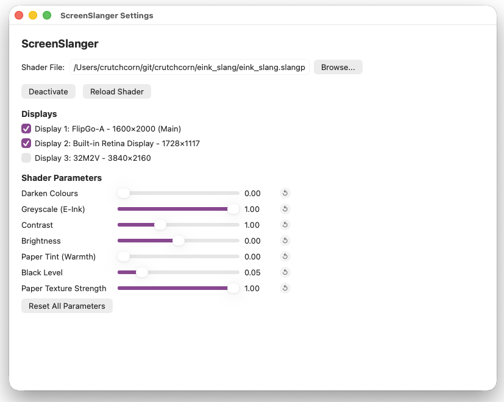

<div align="center">
<h1>ScreenSlanger</h1>


<p>Easy to use utility to apply <a href="https://shader-slang.org/"><code>slang</code></a> shaders to your macOS monitors.</p>

</div>


Useful for applying shaders like [my EINK shader](https://github.com/crutchcorn/eink_slang) or [RetroArch shaders](https://github.com/libretro/slang-shaders) to your monitors in macOS:



# Pre-reqs

- [Homebrew](https://brew.sh/)
- Silicon Mac (M1+) with macOS 26+

# Installation

First, install the pre-req packages:

```shell
brew install spirv-cross glslang
```

Then, [install `slangc`](https://github.com/shader-slang/slang/releases/latest) to `~/slang/bin/slangc`

Finally, [install ScreenSlanger from the DMG in our "Releases" tab.](https://github.com/crutchcorn/ScreenSlanger/releases/latest)

# Usage

Simply open the `.app` and it should automatically prompt you for the `.slang` or `.slangp` files you want to apply and for which screens you want to enable them on.

To test ScreenSlanger, you can use the [waves shader example](./assets/waves.slang) in our project.

# Credits

[ScreenShader for the original code implementation](https://github.com/branpk/ScreenShader/)

[ShaderGlass for various `shaderp` code references](https://github.com/mausimus/ShaderGlass)
